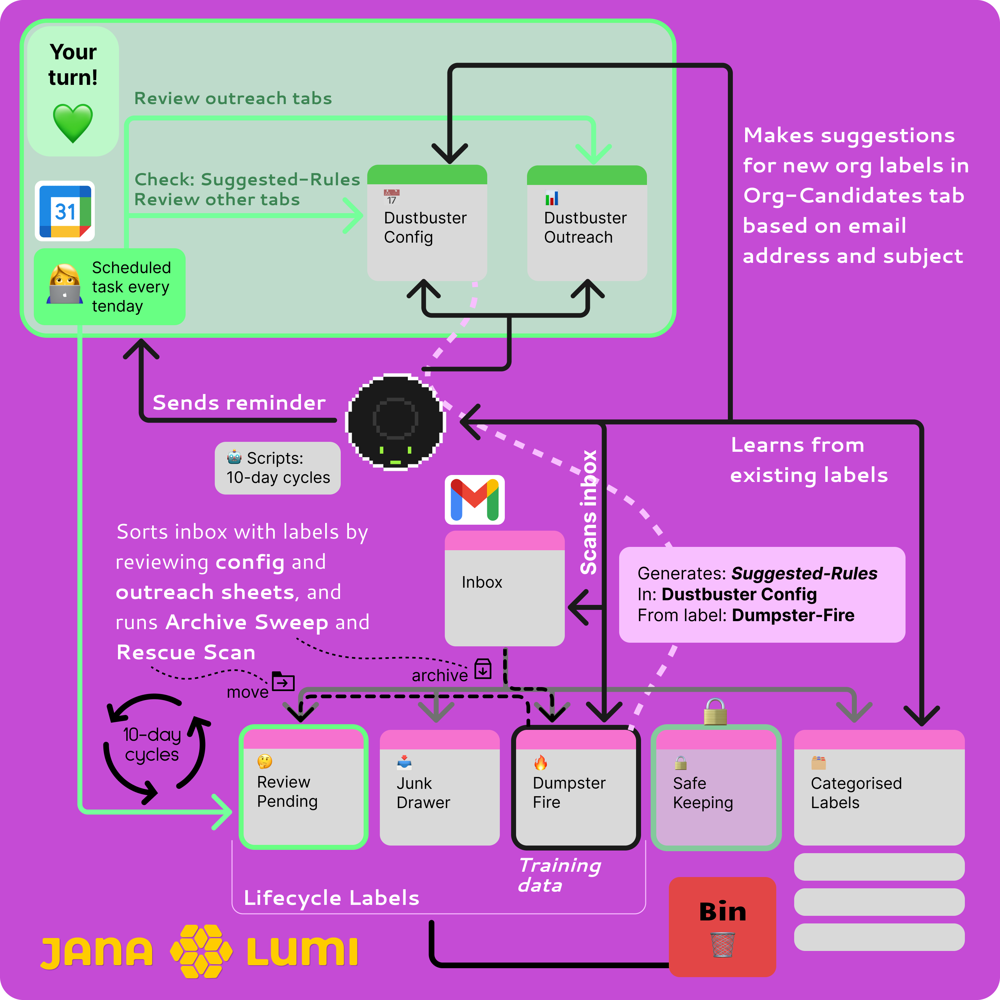
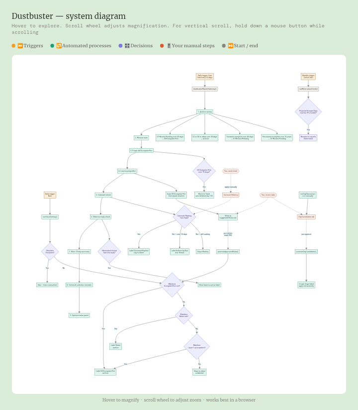

# Dustbuster
Gmail cleanup scripts...and maybe a dustbusting game with [bunnies and dogs](https://polypuput.netlify.app/) -> a new version is in the works...

Dustbuster config link to copy to your google drive: [Googlesheets link](https://docs.google.com/spreadsheets/d/1rM0aczM7yY4RvKJBaGwkP8N5k82d-9Gl5-mSryMbB7g/edit?usp=drive_link)

 
<a href="https://janalumi.github.io/Dustbuster/dustbuster-flowchart.html">OPEN Dusbuster flowchart viewer</a> — use desktop view on mobile.

**Dustbuster — the story of the system**

Every day at eight in the morning, Dustbuster wakes up and looks at your inbox. It reads each new email carefully — not for meaning, but for pattern. It asks three questions in order. First: is this someone you've explicitly protected? If yes, it steps back and leaves the email exactly where it is. Second: does this match a rule you've taught it — a sender domain, a subject keyword, something you've seen before and decided to banish? If yes, it labels the email and moves it out of your way. Third: does it match a known noise pattern — something automated and low-value, but worth keeping just in case? If yes, same treatment. If none of these match, the email stays in your inbox. Dustbuster doesn't guess. It only acts on what it knows.

Every ten days, something larger happens. A master cycle runs — nine steps in sequence, like a slow tide moving through the system. It sweeps the archive, checking whether anything has been sitting in the review queue long enough to be discarded, or whether anything has overstayed its welcome in the inbox. It rescues emails that might have been caught too aggressively. It purges the oldest discarded mail — anything that's been waiting in the discard pile for more than seventy-five days gets moved to trash, and Gmail will finish the job thirty days after that. Then it runs the learning algorithm: it looks at what's been discarded recently, finds senders who keep appearing, and writes suggestions to a tab in your config sheet. You review those suggestions at your own pace, mark the ones you agree with, and on the next cycle they become permanent rules. The system learns, but only with your sign-off.

The cycle also checks your outreach. Any email you've sent and marked as waiting — a cold contact, a pitch, a follow-up you're tracking — gets examined. If a reply has arrived, the thread is moved to replied and logged. If ten days have passed with no answer, the thread gets flagged and starred so it surfaces visibly. Then the cycle checks whether any dormant threads have unexpectedly come back to life — someone replying to something months old — and if so, wakes them up. Finally it writes a ten-day summary, schedules your next reminder, and updates the status panel.

Once a month, on the second, a quieter check runs in the background. It looks at all your project and organisation labels — threads grouped by community, by company, by relationship — and asks how long it's been since anything moved in each one. If a group has been silent for nine months or more, it gets marked as hibernated. It doesn't disappear. It just moves to the edge of the map, waiting to be woken if someone writes again.

Running alongside all of this is an org discovery process you trigger manually when you want it. Dustbuster scans your sent mail and your inbox together, looking for domains and contacts that appear repeatedly in both directions — real relationships, not just newsletters. It surfaces these as candidates. You review them, approve the ones that matter, and the system creates a dedicated label for each one and applies it retroactively to all matching threads.

Your own role in the system is small but decisive. You send emails and apply a waiting label. You review suggestions and approve or reject them. You run org discovery when the moment feels right. Everything else runs without you — quietly, on a rhythm, getting slightly smarter each cycle.
